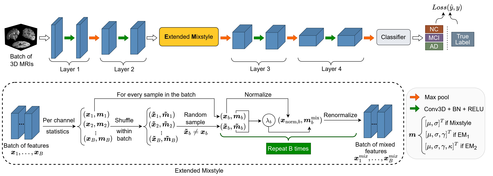

# Extended MixStyle: Higher-Order Domain Generalization in Magnetic Resonance-Based Assessment of Alzheimer's Disease

## Overview
Deep learning models for Alzheimer’s disease assessment from structural MRI often struggle when deployed across new imaging sites with different scanners, acquisition protocols, or patient populations. Traditional domain-generalization approaches such as MixStyle mainly mix means and variances, which may not fully capture complex statistical shifts across cohorts.

In this work, we address **single-domain generalization** (SDG): training on one dataset and testing on unseen domains. We propose Extended MixStyle (EM), a feature-level augmentation strategy that mixes higher-order statistics, including skewness and kurtosis. By blending these moments during training, EM provides a closer approximation of real-world domain variability and encourages the model to learn domain-invariant features, resulting in improved robustness on unseen MRI datasets.

  

## Key Contributions
- Extended MixStyle (EM) that mixes mean, variance, skewness, and kurtosis to capture higher-order variations across domains.
- Plug-and-play feature-level module that can be integrated with minimal changes.
- Single-domain training with cross-dataset evaluation: trained on NACC and tested on ADNI, AIBL, and OASIS, achieving ~2.4-point macro-F1 improvement on average over state-of-the-art SDG baselines.

The implementation will be released upon paper acceptance.
